# Stress Prediction Pipeline: Real-Time Kafka

A containerized Kafka streaming pipeline for processing worker stress data in real-time. Integrates with Java-based Flink for ML inference.

## Live Demo

[https://nurse-stress-prediction-preethika.streamlit.app](https://nurse-stress-prediction-preethika.streamlit.app)

Interactive dashboard showing real-time stress predictions from the LightGBM and GradientBoosting models side by side.

## Architecture

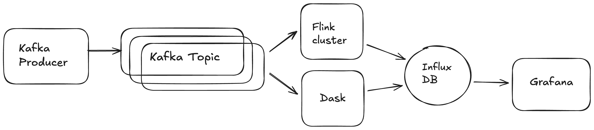

## Flink Workflow

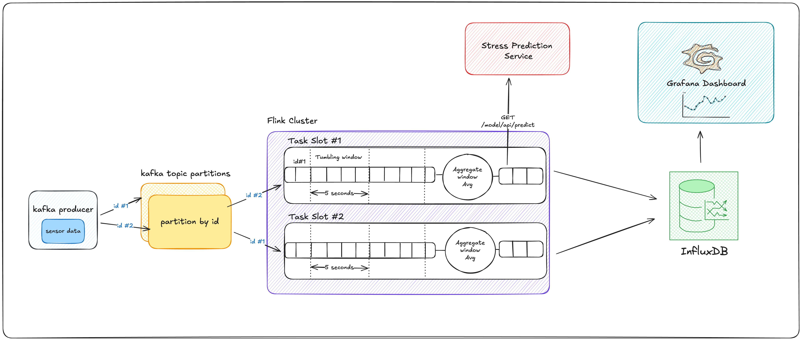

## Prerequisites

- **Docker Desktop** (with Docker Compose v2)
- **Git**
- **Java 17**
- **Python 3.8+** (for local development, optional)
- **2 GB+ available disk space**

## Quick Start For Primary Flink Workflow (5 minutes)

### 1. Clone the Repository

```bash
git clone https://github.com/peppermintflowers/nurse_stress_prediction.git
cd nurse_stress_prediction
```

### 2. Verify Docker is Running

```bash
docker --version
docker compose version
```

Both should output version info. If not, install Docker Desktop.

### 3. Start All Services

From the project root (`nurse_stress_prediction`), run:

```bash
docker compose up --build -d
```

This will:
- Pull/build all images
- Start containers in detached mode
- CSV producer will immediately begin streaming data from csv files in `data/workers.csv.zip` to Kafka

### 4. Verify Services are Running

```bash
docker compose ps
```

### 5. Monitor the Pipeline

**Kafka UI Dashboard** (view topics & messages):
- Open http://localhost:8080 in your browser
- Navigate to **Topics** → **stress-topic** to see messages flowing

  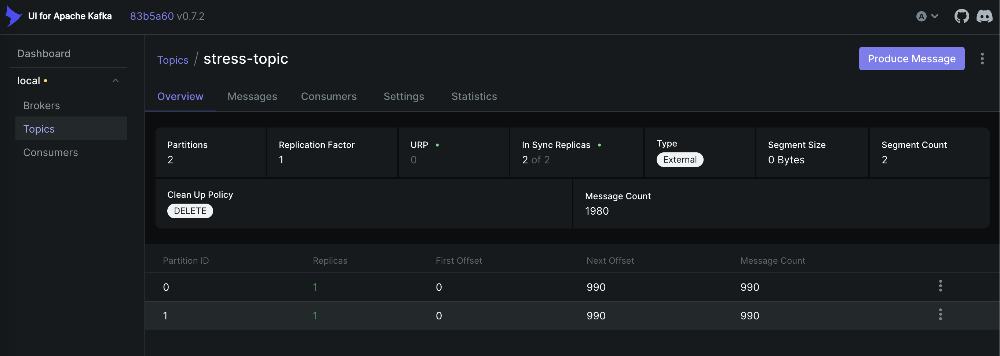

- Open http://localhost:8081 in your browser
- Check that Flink is up and two task slots are available

  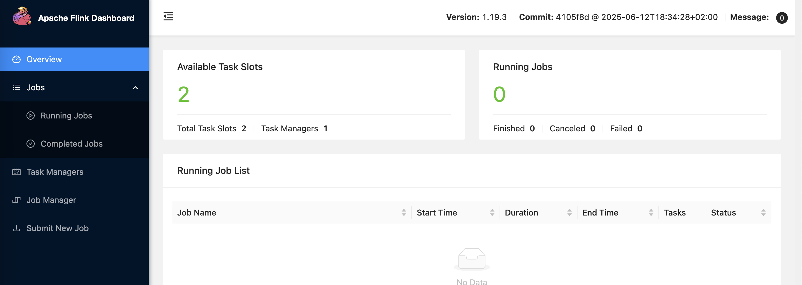

**Producer Logs** (see data being sent):
```bash
docker compose logs csv-producer --tail 50 -f
```

**View logs for other services:**
```bash
# All services
docker compose logs -f

# Specific service
docker compose logs kafka -f
docker compose logs csv-producer -f
docker compose logs flink-jobmanager -f

# Last N lines
docker compose logs --tail 100
```

### 6. Build Flink Job Jar

Run from project directory:

```bash
cd flink-stress-data-processor
mvn clean package
```

After executing the above commands the `flink-stress-data-processor-1.0-SNAPSHOT.jar` should get generated in the `target` folder of the `flink-stress-data-processor` directory.

### 7. Submit Flink Job Jar

- Open http://localhost:8081 in your browser
- Upload the jar file `flink-stress-data-processor-1.0-SNAPSHOT.jar` generated in the previous step and submit the job

  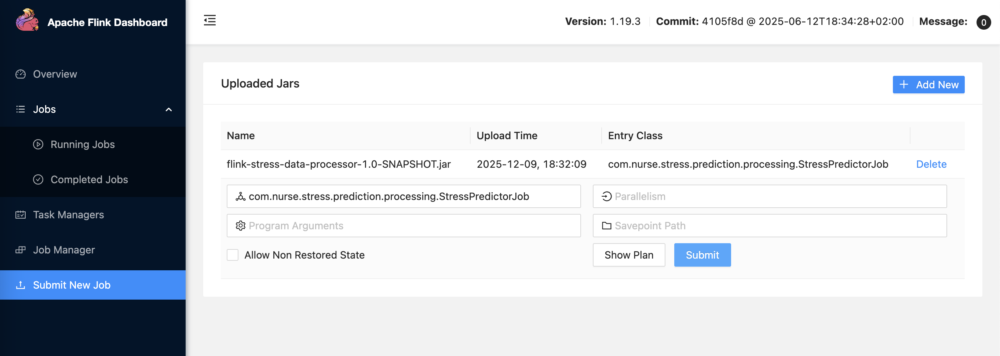

- Verify that the job is running and that real-time watermarks are generated

  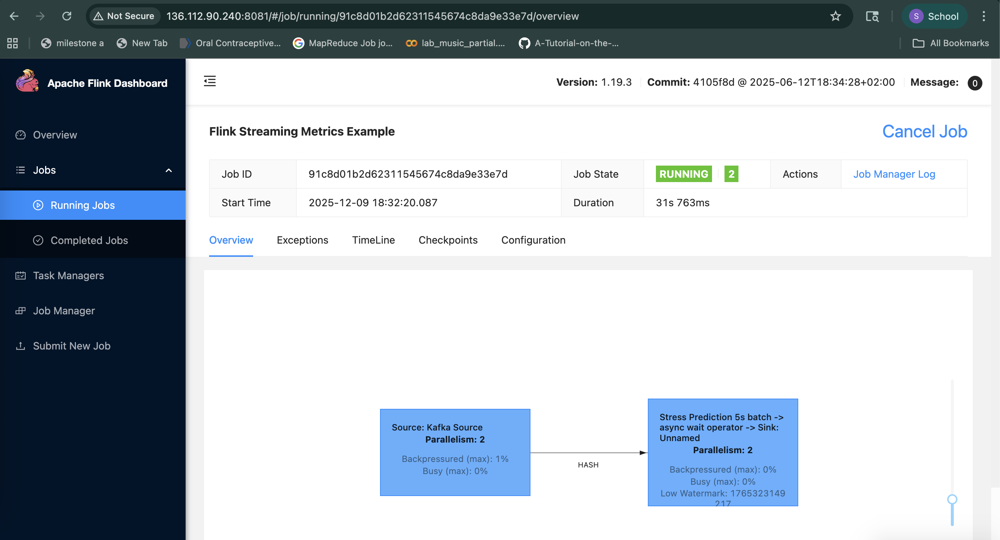
  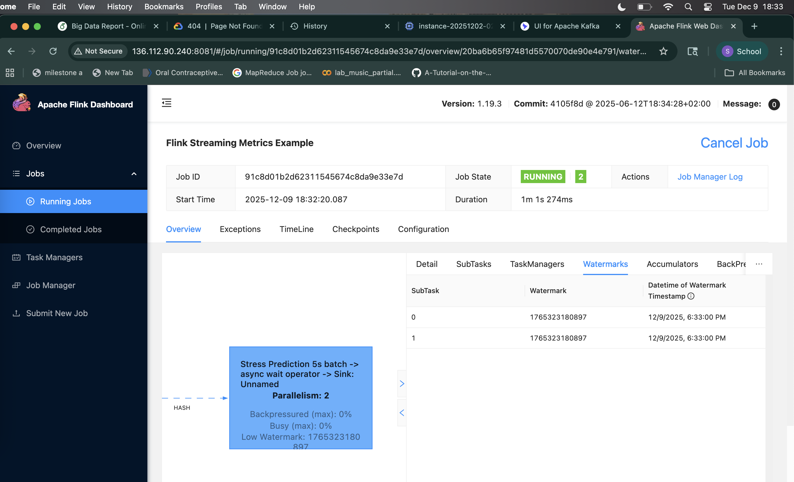

### 8. Create dashboard in Grafana and visualise results

- Open http://localhost:3000 in your browser
- Use `admin/admin` as credentials
- Connect to InfluxDB
- Use the UI to build queries and create dashboards to visualise the real-time processed data
- The Grafana dashboard was created in UI for Flink and its code has been exported to `grafana_dashboard_for_flink.json` and placed in the directory `grafana_dashboard_json`

  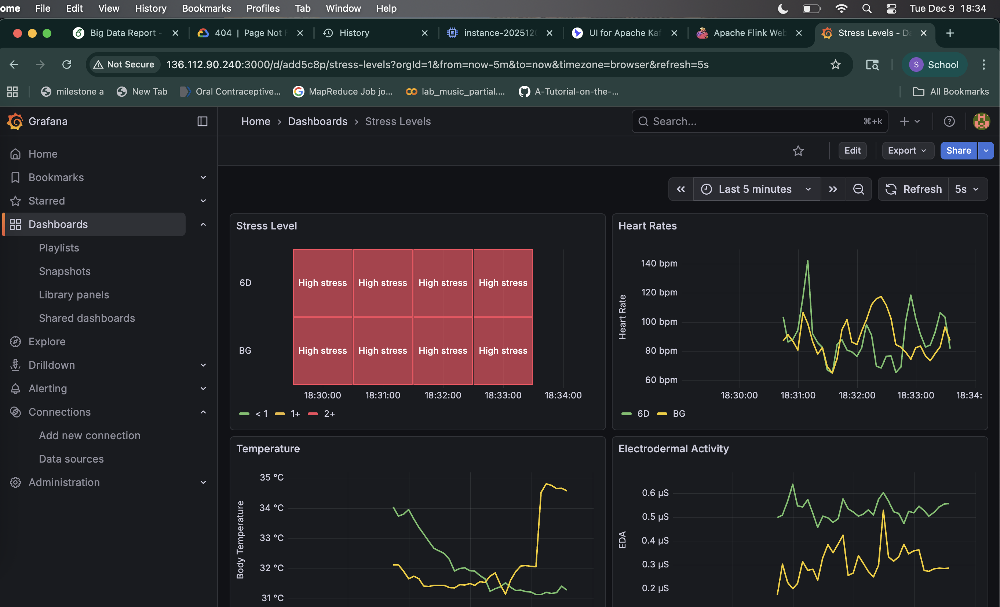

  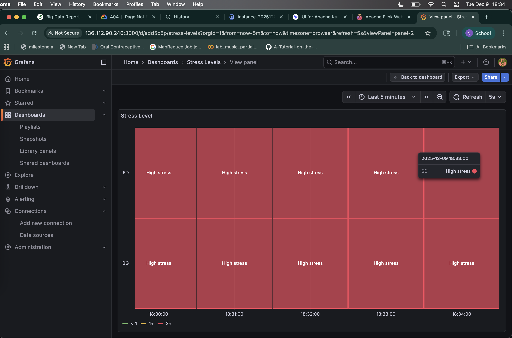

  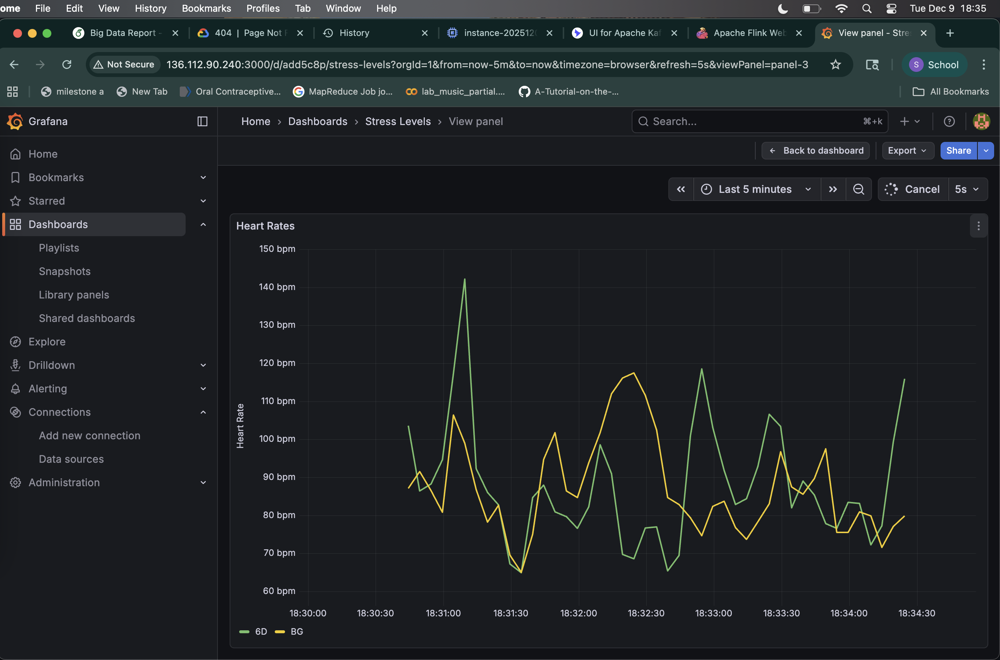

  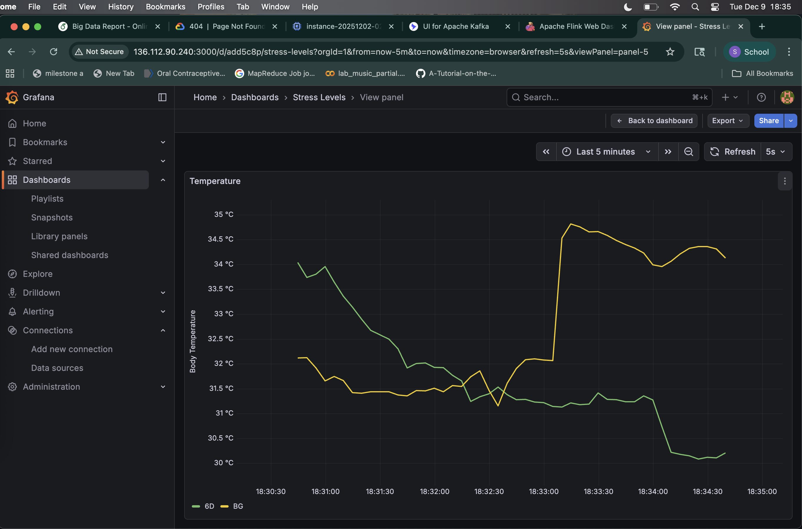

  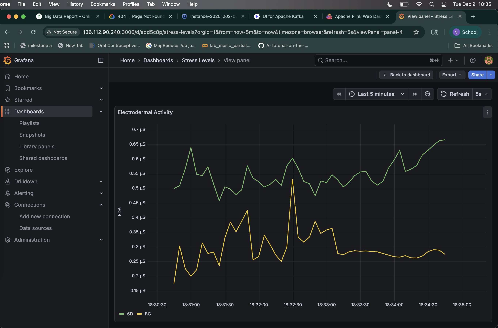

## Streamlit Demo Dashboard

A standalone demo dashboard is available at:

[https://nurse-stress-prediction-preethika.streamlit.app](https://nurse-stress-prediction-preethika.streamlit.app)

To run it locally:

```bash
pip install -r requirements.txt
streamlit run streamlit_dashboard.py
```

The dashboard runs in simulated mode by default. To enable live predictions, start the Flask API first:

```bash
cd flask-predictor
python app.py
```

## ML Models

Two models are trained on physiological sensor data from wearable devices (Empatica E4 wristband):

| Model | File |
|---|---|
| LightGBM | `ml_model/stress_prediction_model_lgbm.joblib` |
| GradientBoosting | `ml_model/stress_prediction_model.joblib` |

**Features:** `Orientation_X`, `Orientation_Y`, `Orientation_Z`, `Heart_Rate`, `Skin_Temp`, `EDA`

**Stress labels:** `0` = No stress, `1` = Moderate stress, `2` = High stress

**API endpoint:** `GET /model/api/predict?x=&y=&z=&eda=&hr=&temp=&model=lgbm`

## Dask Fallback System

This project includes an automatic fallback system using Dask ML that activates when the primary Flink pipeline experiences resource constraints. The fallback ensures continuous stress monitoring without data loss.

**Key features:**
- Automatic switching based on processing latency
- Processes larger batches (1000 messages) at lower frequency
- Zero data loss via Kafka checkpoints
- Fully configurable thresholds and batch sizes
- Writes to same InfluxDB with `source=dask-fallback` tag

**Quick start:**
```bash
# System monitors automatically - no action needed
docker compose up -d

# View fallback status
docker compose logs dask-fallback -f

# Test the fallback
cd dask-fallback && ./test_fallback.sh
```

**Documentation:**
- [Integration Guide](DASK_FALLBACK_INTEGRATION.md) — How it works with existing system
- [Full Documentation](dask-fallback/README.md) — Detailed technical docs
- [Quick Start](dask-fallback/QUICK_START.md) — Commands and tips

## Project Structure

```
.
├── assets                        # images used in README
├── dask-fallback                 # dask-fallback code and documentation
├── data                          # kafka producer code, data source and data downsampling code
├── flask-predictor               # Flask API that serves both ML models
├── flink-stress-data-processor   # Flink job code
├── grafana_dashboard_json        # exported JSON for Grafana dashboards
├── ml_model                      # model training code and .joblib model files
├── docker-compose.yml
├── requirements.txt
├── streamlit_dashboard.py        # Streamlit demo dashboard
└── README.md
```

**Branch:** `main`
**Created:** November 2025
